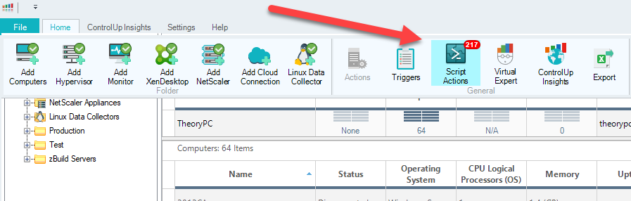
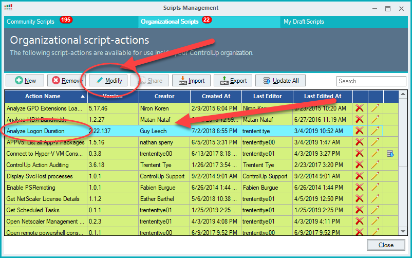
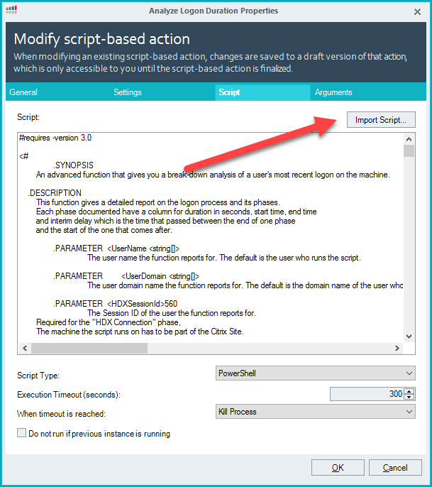
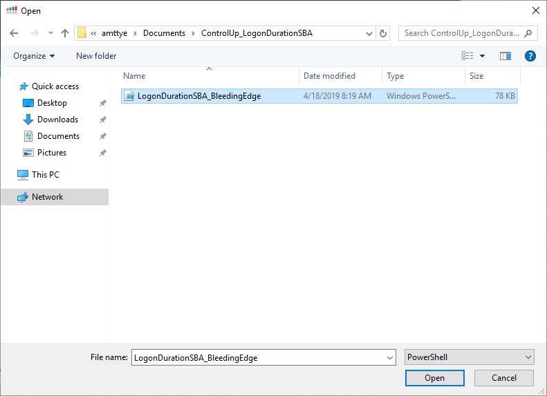
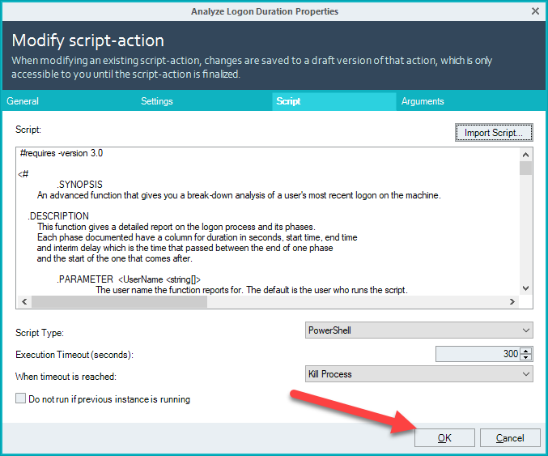
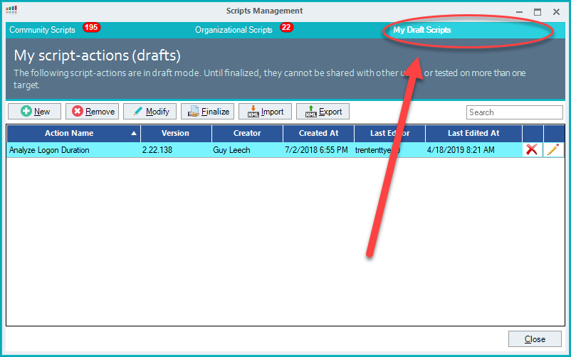
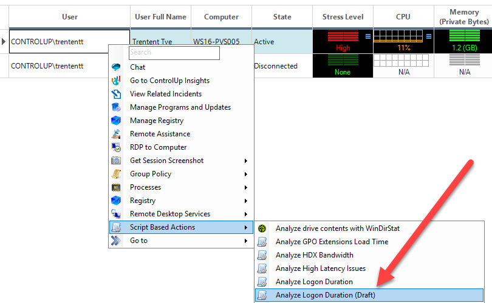

# LogonDurationSBA
Logon Duration SBA

ControlUp Logon Duration SBA for change and issue tracking.

This script is the bleeding edge and not ready for general consumption as QA has not been completed.

In order to try this script in your ControlUp environment simply do the following:

Open Script Actions or Script Based Actions

Find the "Analyze Logon Duration" SBA and click on it, then click Modify

Click Import

Find the version of the script you downloaded from Github and select it

Click OK

Select the "My Draft Actions" tab and note that the SBA is there.  It's recommended to keep these beta scripts in draft until you've tested thoroughly.  Once your testing shows that it works as expected and contains the features you want, finalize it to grant other members of your organization access to it.

To test the script, select the one with "(Draft)" next to the name.
